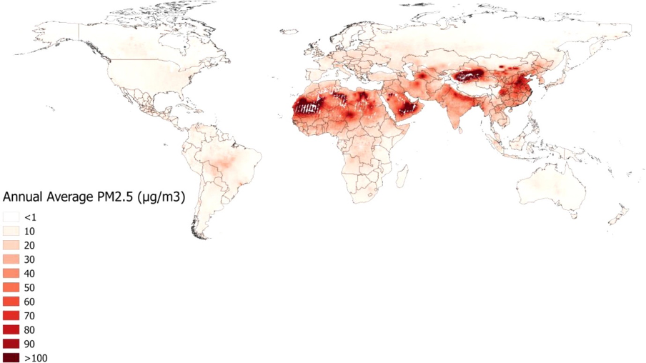
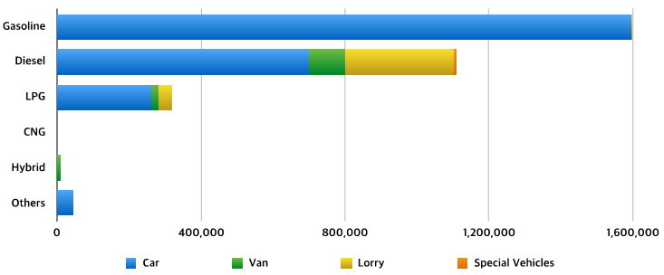

# Introduction {#intro}

<!--
You can label chapter and section titles using `{#label}` after them, e.g., we can reference Chapter \@ref(intro). If you do not manually label them, there will be automatic labels anyway, e.g., Chapter \@ref(methods).

Figures and tables with captions will be placed in `figure` and `table` environments, respectively.
-->


```{r worldpm25, echo=FALSE, fig.cap="Estimated 2013 annual average of PM~2.5~ in the troposphere as detected by the grid cell average of satellite-based estimates from the TM5-FASST simulation. (imported from @Brauer2016)", out.width = '100%'}

```


```{r seoulmap, echo=FALSE, fig.cap="Basemap (A) and Topography (B) of Seoul", out.width = '100%'}
knitr::include_graphics("Figures/Chapter1/seoul.png")
```


```{r emission, echo=FALSE, fig.cap="Annual Amount of Pollution Emission in Seoul (Units: Tonnes/Year(s))", out.width = '100%'}
knitr::include_graphics("Figures/Chapter1/PollutionEmission.png")
```


```{r emissionbysources, echo=FALSE, fig.cap="Seoul Air Pollution Emissions by Sources", out.width = '100%'}
knitr::include_graphics("Figures/Chapter1/PollutionEmission_bysources.png")
```


```{r vehicles, echo=FALSE, fig.cap="Total Vehicles in Seoul 2016 by fuel types", out.width = '100%'}

```