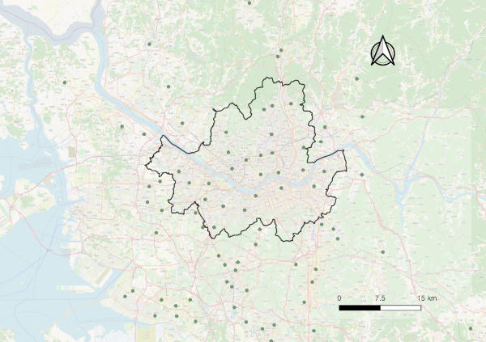

# Comparison of Spatial Interpolation Methods for the Estimation of Seoul’s Air Pollution {#study1}
**Overview**

This chapter firstly explores the pollution data in different time sequences and types of monitoring stations.
Then it compares two spatial interpolation methods, Universal Kriging, GAM, with additional weights on road layers as an effect of roadside pollution fields. 
After the calibration and validation, this chapter finally discusses issues relevant to interpolation methods and health effects.


## Data list
### Pollution

| Components  | Variables  | References                                     |
|-------------|------------|------------------------------------------------|
| Exposure    | PM~10~     | National   Institute of Environmental Research |
| Exposure    | NO~2~      | National   Institute of Environmental Research |
| Road Weight | Road Layer | Korean Transport Database (KTDB)     |

* Pollution
    - This study selected PM~10~ as the main source that can causally result in human cancer and NO~2~ as the main source that harms respiratory symptoms, whether constantly or instantaneously [@WHO2013].
    - 57 background stations (installed on the rooftops of district offices)
    - 19 roadside stations (close to the major roads which are strongly affected by nearby traffic) (see Figure \@ref(fig:stations)). 
    - Download period: 01/01/2010 01:00 and 01/01/2018 00:00
    - Units: in ppb (parts per billion) for NO~2~, and µg/m^3^ for PM~10~.


```{r stations, echo=FALSE, fig.cap="Background pollution stations that are considered for spatial interpolation (boundary area: Seoul)", out.width = '100%'}

```


* Road Layer
    - Seoul had 59,319 road segments in total, 
    - The attributes of each segment included node ID, link ID, number of lanes, maximum speed, traffic light density, and road ranks
    - Road segments were grouped by their road ranks as a level to distinguish different pollution loading. Rural and county roads 105, 106, and 107 were excluded due to a small fraction existing in Seoul. 
    - The roads were regrouped as general roads (103, 104), and highways (101, 102, 108) to distinguish the pollution loads by two road types.

| Rank | Name                             | Group   |
|------|----------------------------------|---------|
| 101  | Highway                          | Highway |
| 102  | Urban highway                    | Highway |
| 103  | National road                    | General |
| 104  | Metropolitan road                | General |
| 105  | Rural road, government-supported | -       |
| 106  | Rural road                       | -       |
| 107  | County road                      | -       |
| 108  | Highway ramp                     | General |


## What the data looks like: Exploration with R


## Output: Univeral Kriging 


## Output: Generalised Additive Models


## Summary


